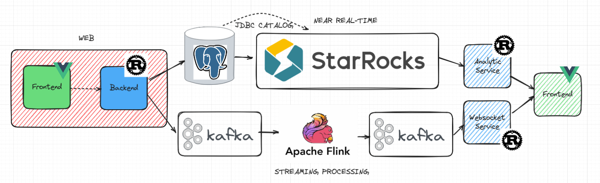

# Streaming-analytic-playground

This is a playground for streaming analytics that uses Apache Flink SQL as a framework to process data in streaming mode from the Kafka message broker and streams it back to Kafka. Not only streaming analytics, but I also use Starrocks as an OLAP system for near real-time data processing, where Starrocks can obtain data from OLTP (Postgres) without any extraction process (Zero Extract). In this playground, Rust is used as the backend with the Axum framework, and Vue is used as the frontend framework.